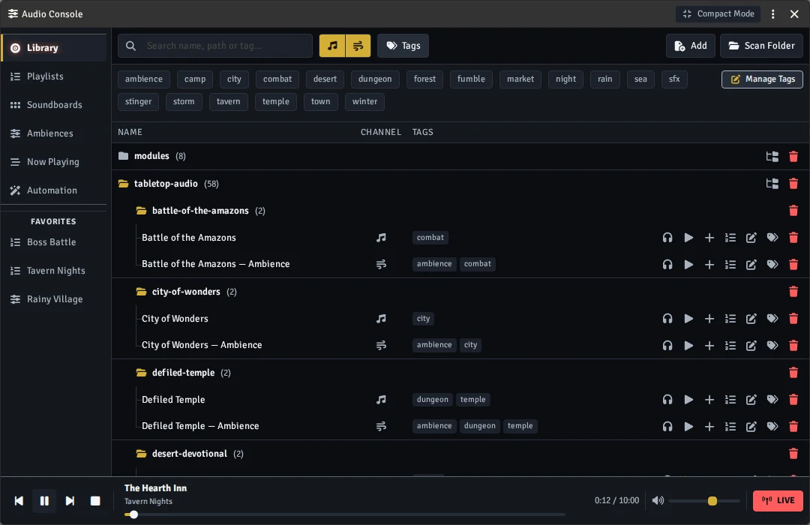
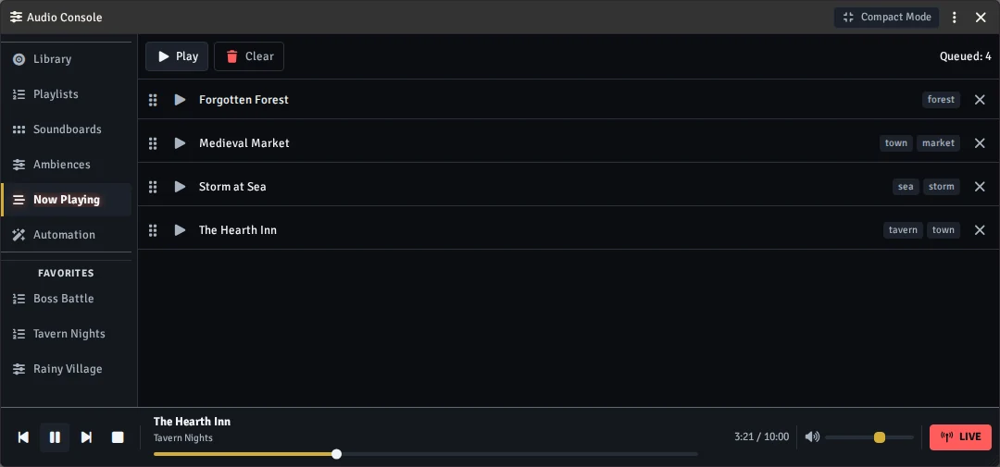
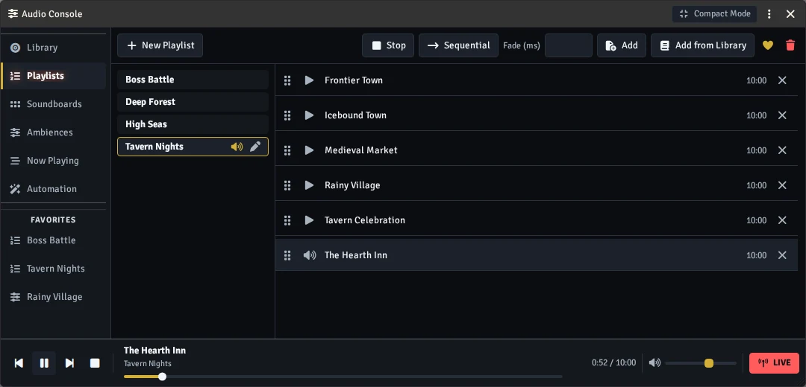
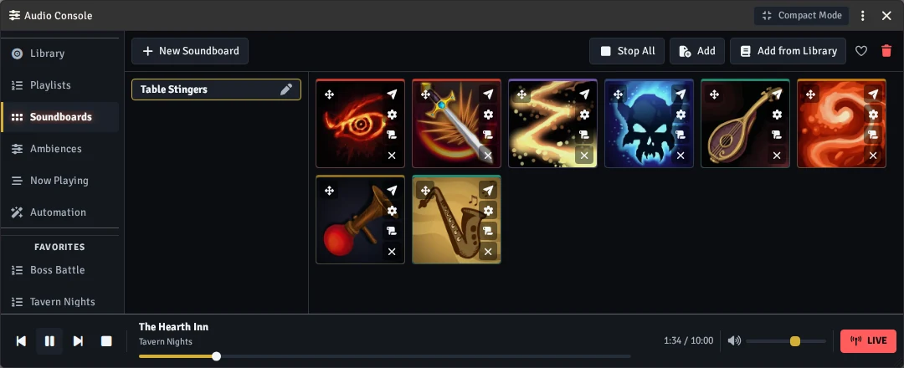
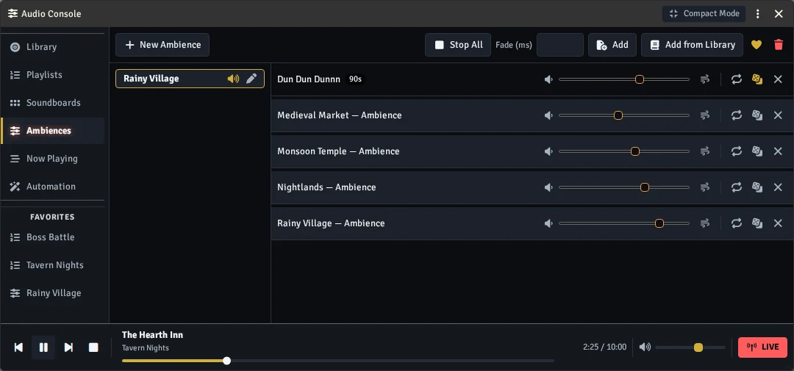
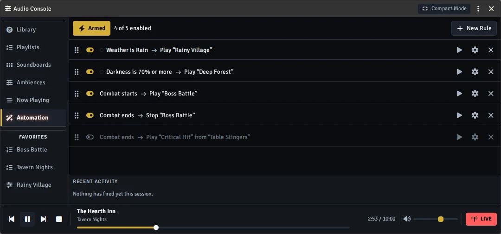
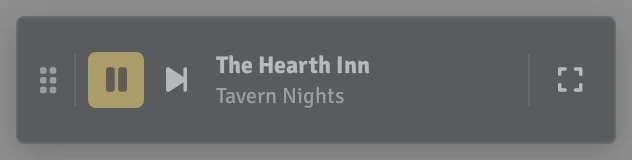

# 🎛️ Audio Console

**Your table's music, ambience and sound effects — in one window!**

Stop juggling the Playlists sidebar mid-session. Audio Console gives the Game Master a single
mixing desk: a searchable music library, playlists, a soundboard of one-shot pads, layered
ambience beds, and rules that change the music on their own when the storm rolls in or combat
starts.



[](https://buymeacoffee.com/mestredigital) [](https://mestredigital.online/pages/projetos-en)

---

# ✨ What makes it different

- 🎧 **Nothing plays by accident.** Playback starts in **Preview** — only you hear it. Flip the
  transport to **LIVE** when you actually want the table to hear it.
- 🗂️ **Tag your music once, use it forever.** The library lives outside your worlds, so a new
  campaign starts with your whole collection already catalogued.
- 🧩 **No lock-in.** Everything it creates is a normal Foundry playlist. Turn the module off and
  your audio is still there, still playable from the sidebar.
- 🖱️ **Built for live play.** One window, big buttons, a compact bar for when you need the screen
  back.

---

# 🎁 Features

### 📚 Library — your whole collection, catalogued

Add files one at a time, or **Scan Folder** to register hundreds at once — pick the channel and
tags up front and every new file in the folder (subfolders too, if you like) gets them. Browse by
folder or search by name, path or tag. Tag freely — **tavern**, **combat**, **storm** —
and filter by tag or by channel (Music / Ambient). Files that go missing are flagged, never
silently dropped. A **Manage Tags** panel renames or deletes a tag across every track at once.
Drag a track onto the map for an ambient sound, onto the hotbar for a macro, or use **Save as
Macro** to create one without taking a hotbar slot.

### ▶️ Now Playing — a queue you can see

Everything you fire lands in a visible queue. Play, stop, reorder, clear. No more wondering what is
still running somewhere in the background.

The transport bar at the bottom plays, pauses, skips and stops, and its progress bar can be
clicked or dragged to seek. **Repeat** loops the current track. Music and ambience are each one at
a time: starting a playlist or a track stops the other music, starting an ambience stops the other
ambience — but music and an ambience still play together, and soundboard pads play over anything.



### 🎶 Playlists — sequential or shuffle

Ordinary playlists built from the library, with drag-to-reorder and a fade control. They are native
Foundry playlists, so they behave exactly the way you already expect.



### 🔊 Soundboards — one-shot pads for the moment

A grid of pads for stingers: a door slam, a wolf howl, a critical hit. Each pad has its own volume
and loop setting, and can **fire on its own random interval** for background noise that never
repeats the same way twice. Switch on **Duck Music** for a board and the music dips on every
player's client while one of its pads plays, then comes back on its own. Drag a pad to the hotbar to turn it into a **macro**, drop it **on the
map** to place it as an ambient sound — Foundry fills in the file and volume, you set the radius,
and only players with a token in range hear it — or send a sound to **one single player**, so only
they hear it.



### 🌧️ Ambiences — build a soundscape in layers

Stack layers into one scene bed — rain, market, distant night — each with its own volume and loop.
Any layer can be put on a random interval so a thunderclap fires now and then instead of looping.
Timed layers don't all go off the moment the ambience starts — their first play is spread out —
unless you tick **Also play when the ambience starts** for the ones that should. Play all, stop
all, or mix live.



### 🤖 Automation — audio that follows the scene

Write simple rules: **when scene weather is rain → play "Rainy Village"**, **when darkness is 70% or
more → play "Deep Forest"**, **when the Tavern scene is active → play "Tavern Night"**, **between
20:00 and 06:00 on the world clock → play "Night Ambience"**, **when combat starts → play "Boss
Battle"**, **when combat ends → stop it**. Rules can play a playlist,
an ambience, a single track or a pad — or stop things, including everything at once. A single
**Armed / Disarmed** switch keeps automation from firing until you say so, and a recent-activity log
shows what fired and when. **Test Rule** fires any rule on the spot, without waiting for its
condition.



### 🪟 Compact Mode — get your screen back

Collapse the console into a small frameless bar: see what is playing, pause or skip it, and expand
back when you need the full window. **Favorites** keep the playlists, soundboards and ambiences you
reach for most within one click of the console's rail, and **Pop Out** opens any playlist,
soundboard or ambience in a small window of its own.



---

# 🚀 Getting started

1. **Enable the module** in your world. An **Audio Console** button appears in the
   Sounds scene controls and in the Playlists sidebar header. (GM only — players never see it.)
2. **Fill the library.** Open the **Library** section and use **Add** for a single file, or
   **Scan Folder** to register a whole folder at once.
3. **Build something.** Make a playlist, a soundboard or an ambience and add tracks from the library.
4. **Play it.** Audition in **Preview** with your headphones on, then hit the mode toggle to go
   **LIVE** when the table should hear it.

---

# 🎮 Opening it from a macro

Want the console on your hotbar? Make a **script** macro with one line:

```js
AudioConsole.Open();
```

It opens whichever mode you left it in, the full window or the compact bar — exactly what the
buttons do. GM only, same as everything else: a player who runs it just gets a notice.

---

# 💾 Where your library lives (and how to back it up)

Your catalogue is **not** stored inside a world. It lives in `Data/audio-console/`, next to
`worlds/` and `modules/` in your Foundry installation. That is deliberate:

- ✅ **Shared by every world** on this installation — tag once, use in every campaign.
- ✅ **Survives** updating or uninstalling the module.
- ⚠️ **Not** included in a world export or world backup.
- ⚠️ **Not** synced between computers — moving installation means copying that folder yourself.

Because of those last two, go to **Settings → Library Maintenance** and use **Export a Copy**: it
downloads `library.json` through your browser, and *that* download is the real backup. The same
panel can **import** a catalogue from another installation (merge or replace), or **consolidate**
every library file into the module's own folder — handy before moving machines.

> Note: Foundry's file API cannot delete, move or rename files, so this module never touches your
> audio files. Removing or tidying the actual files is always done in your operating system.

---

# 🚀 Installation

Install via the Foundry VTT Module browser or use this manifest link:

```js
https://raw.githubusercontent.com/brunocalado/audio-console/main/module.json
```

---

# 🧰 For content creators

Modules and script macros can fill the library and build playlists, soundboards and ambiences
through a small setup API — including content packs that the GM can later **Sync** from
**Settings → Library Maintenance**. See [`docs/API.md`](docs/API.md).

---

# 📜 License

* GNU General Public License version 3. See `LICENSE`.

* [thumbnail](https://unsplash.com/license)
